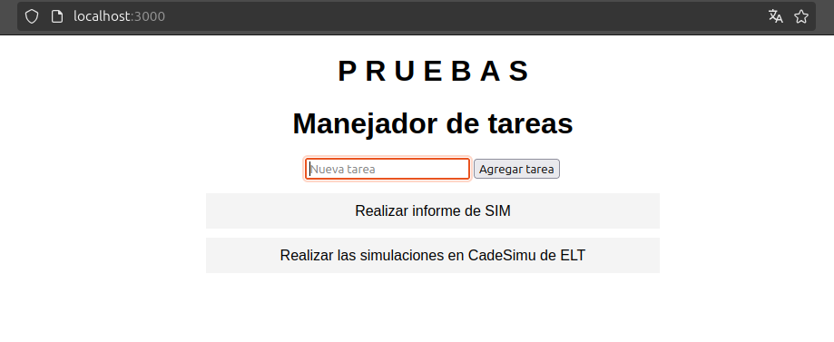
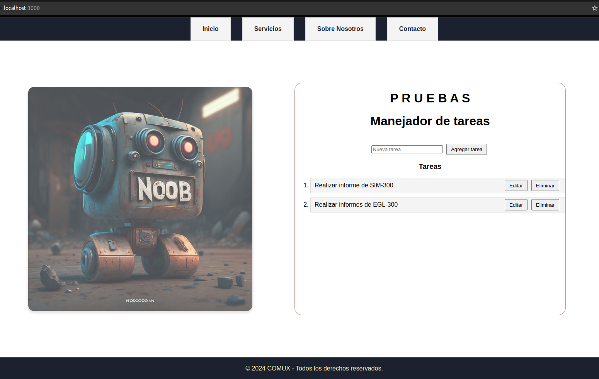

# Gestión de Tareas 


Este proyecto es una aplicación de gestión de tareas que permite a los usuarios crear, listar, editar y eliminar tareas, almacenando los datos en una base de datos MySQL. El frontend está desarrollado en HTML, CSS y JavaScript, y el backend está implementado en Node.js con el framework Express. MySQL se utiliza como sistema de gestión de bases de datos.

## Requisitos Previos

Antes de comenzar, asegúrate de tener instalado lo siguiente en tu máquina:

- [Node.js](https://nodejs.org/) (v18.19.1)
- [MySQL](https://dev.mysql.com/downloads/) (8.0.39)
- [Git](https://git-scm.com/) (para clonar el repositorio)

### Instalaciones requeridas

### 1. **Instalar Node.js**

Si aún no tienes Node.js, puedes descargarlo e instalarlo desde [nodejs.org](https://nodejs.org/).

Para verificar que Node.js esté correctamente instalado, ejecuta el siguiente comando en tu terminal:

```bash
node -v
```

Deberías ver la versión de Node.js que instalaste.

### 2. **Instalar MySQL**

Para instalar MySQL, sigue las instrucciones de la [documentación oficial](https://dev.mysql.com/doc/mysql-installation-excerpt/5.7/en/).

Luego, verifica que MySQL esté instalado correctamente ejecutando:

```bash
mysql --version

```

Asegúrate de crear una base de datos y tabla para el proyecto como se describe más adelante.

### 3. **Instalar Git**

Para clonar el proyecto desde GitHub, asegúrate de tener Git instalado. Puedes descargarlo [aquí](https://git-scm.com/downloads).

Verifica que Git esté correctamente instalado con:

```bash
git --version
```

## Configuración del Proyecto

### 1. Clonar el Repositorio

Primero, clona el repositorio a tu máquina local utilizando Git:

```bash
git clone <https://github.com/antonio9949257/prueba-manejadortareas.git>
```

Cambia al directorio del proyecto:

```bash
cd prueba-manejadortareas
```

### 2. Instalar Dependencias

Dentro del directorio del proyecto, ejecuta el siguiente comando para instalar todas las dependencias necesarias del proyecto:

```bash
npm install
```

Esto instalará todas las dependencias listadas en el archivo `package.json`, incluyendo Express y otras bibliotecas necesarias.

### 3. Configurar la Base de Datos

Crea una base de datos en MySQL para la aplicación:

1. Abre tu terminal y accede a MySQL con tu usuario y contraseña:
    
    ```bash
    mysql -u root -p
    ```
    
2. Crea una base de datos llamada `gestion_tareas`:
    
    ```sql
    CREATE DATABASE ManejadorTareas;
    ```
    
3. Usa la base de datos creada:
    
    ```sql
    USE ManejadorTareas;
    ```
    
4. Crea una tabla llamada `tareas`:
    
    ```sql
    CREATE TABLE tareas (
        id INT AUTO_INCREMENT PRIMARY KEY,
        nombre VARCHAR(255) NOT NULL,
    );
    ```
    

### 4. Configurar el Archivo `.env`

Renombra el archivo `.env.example` a `.env` y edita las variables de entorno con la información de tu base de datos MySQL.

```bash
mv .env.example .env
```

El contenido del archivo `.env` debería ser similar a:

```
DB_HOST=localhost
DB_USER=root
DB_PASSWORD=tu_contraseña
DB_NAME=gestion_tareas
PORT=3000
```

### 5. Iniciar el Servidor

Finalmente, para iniciar el servidor, ejecuta:

```bash
node app.js
```

Esto iniciará el servidor en `http://localhost:3000`.

### 6. Acceder a la Aplicación

Abre tu navegador y navega a `http://localhost:3000` para ver la aplicación de gestión de tareas en funcionamiento.

---

## Estructura de Archivos del Proyecto
```
prueba-manejadortareas
├── app.js
├── package.json
├── package-lock.json
├── publico
│   ├── estilos.css
│   ├── index.html
│   └── main.js
└── README.md
```
## Funcionalidades

- **Agregar Tarea**
- **Listar Tareas**
- **Editar Tarea**
- **Eliminar Tarea**

## Tecnologías Utilizadas

- **Frontend**: HTML, CSS, JavaScript
- **Backend**: Node.js, Express
- **Base de Datos**: MySQL

